# Meridian

A school quality assessment platform that operationalizes Bellwether's [School Quality Framework](https://bellwether.org/blog/reimagining-excellence-introducing-bellwethers-school-quality-framework/) (SQF). Meridian helps consulting teams and schools move through diagnostic assessments faster using structured workflows, evidence traceability, and multi-level AI.

This is not a generic dashboard or a single chatbot. It is a **workflow + ontology + evidence system** for school quality engagements — grounded in Bellwether's public 9 dimensions and 43 components, with every finding traceable back to source documents.

## Architecture

**Monorepo with two services:**
- `backend/` — Python FastAPI + PostgreSQL (async via SQLAlchemy + asyncpg)
- `frontend/` — Next.js 16 + React 19 + Tailwind CSS 4

Frontend proxies `/api/*` to the backend via `next.config.ts` rewrites. See [CLAUDE.md](CLAUDE.md) for developer details and [handoff.md](handoff.md) for the full product vision.

## Running locally

```bash
# Prerequisites: PostgreSQL running, database "meridian" created
# Backend .env must have OPENAI_API_KEY set (see backend/.env.example)

cd backend && source .venv/bin/activate && uvicorn app.main:app --port 8000 --reload
cd frontend && npm run dev
```

The backend auto-creates tables and seeds demo data on startup (Lincoln Innovation Academy, a fictional K-8 charter school). To reset, drop and recreate the `meridian` database.

---

## Feature Tour

The screenshots below walk through Meridian using the seeded demo engagement for **Lincoln Innovation Academy** — a K-8 charter school in Metro City Public Schools with 420 students.

### Dashboard

The engagement dashboard gives a high-level view of assessment progress. KPI cards show evidence collected, components scored, confirmations, and pending data requests. Below, the **SQF Assessment Progress** heatmap visualizes all 9 dimensions and 43 components at a glance — color-coded by rating (Excelling, Meeting Expectations, Developing, Needs Improvement, Not Rated).


The lower half of the dashboard surfaces **Key Findings** (the most notable preliminary ratings with one-line evidence summaries) and a **Recent Evidence** feed showing all uploaded documents.

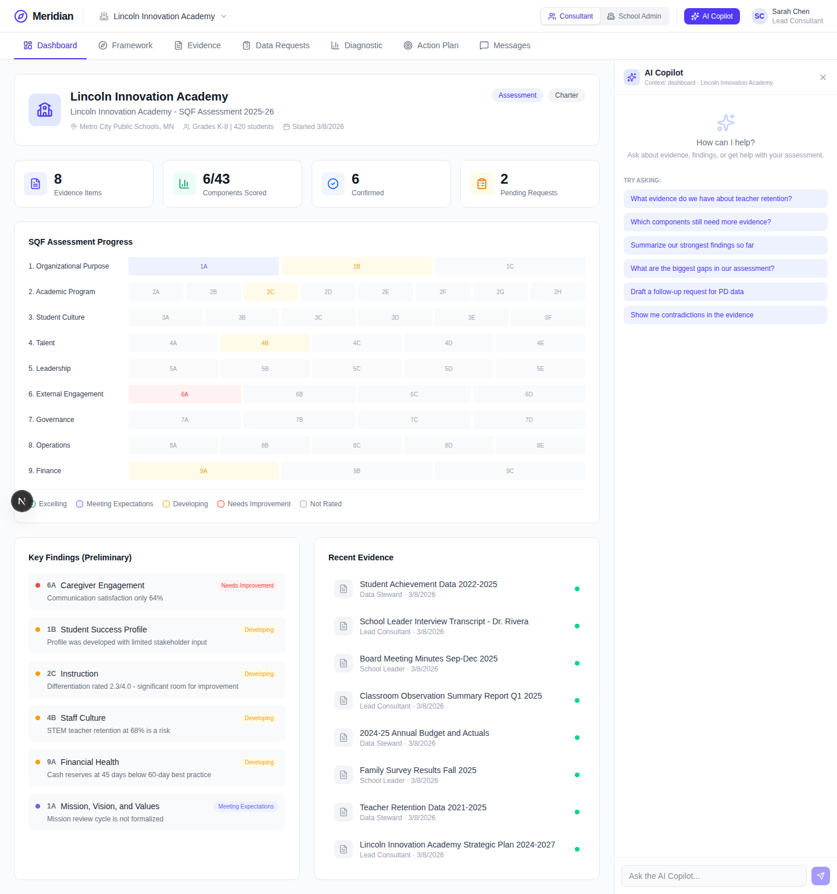

### School Quality Framework Browser

The Framework tab lets users explore Bellwether's SQF structure: 9 dimensions, 43 components, each with Core Actions and Progress Indicators. The three-column layout shows dimensions on the left, components in the center (with ratings and confidence levels), and detailed success criteria on the right.


Selecting a component reveals its full success criteria — the specific Core Actions and Progress Indicators that define what each rating level looks like.

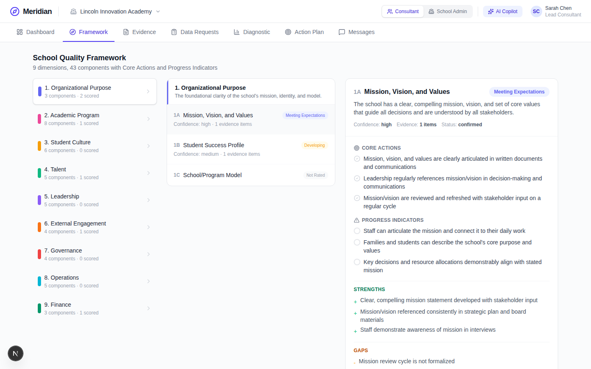

### Evidence Repository

The Evidence tab is where all source documents live — achievement data, interview transcripts, board minutes, observation reports, budgets, survey results, retention data, and strategic plans. Each document shows its processing status and who uploaded it.

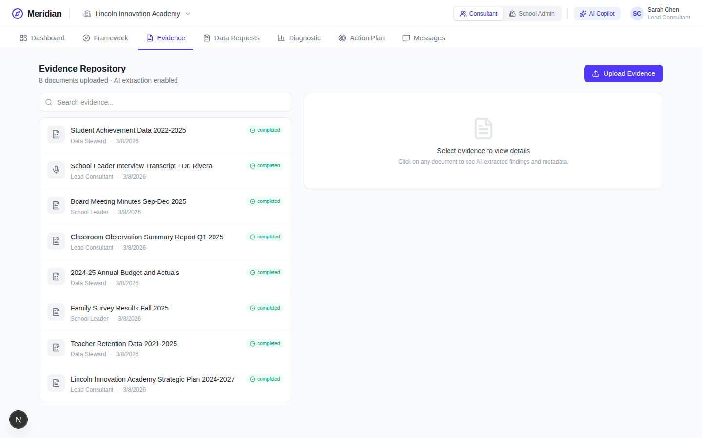

Selecting a document reveals its **AI extraction** — a structured summary and numbered key findings automatically generated when the document was uploaded. The extraction model is shown (e.g., gpt-4.1-mini) for transparency.

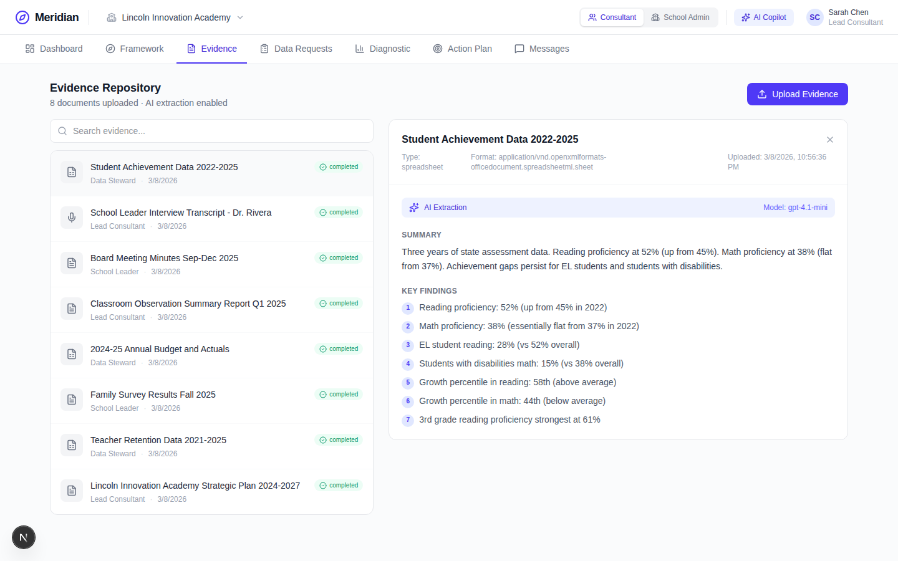

### Data Requests

Consultants send structured data requests tied to specific framework needs. Each request has a priority level, assignee, status (Pending, In Progress, Accepted, Submitted), and a rationale explaining why the data matters. An inline messaging thread lets consultants and school staff discuss each request without leaving context.

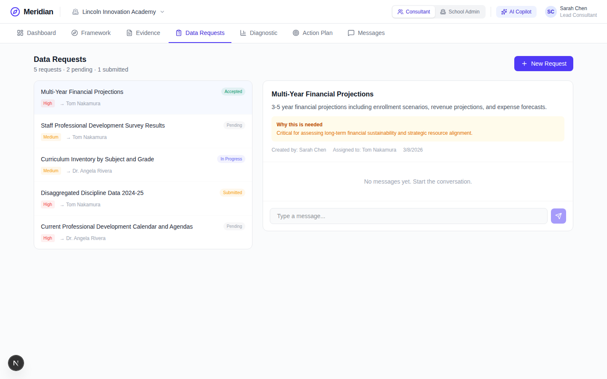

### Diagnostic Workspace

The Diagnostic tab is the AI-powered scoring workspace. It implements Meridian's **4-layer AI architecture**:
- **Layer 2 (Components)** — assess individual components against their success criteria using mapped evidence
- **Layer 3 (Dimensions)** — synthesize patterns across components within a dimension
- **Layer 4 (Global)** — executive summary across all dimensions

Each dimension row shows mini badges for its components — colored when scored, gray when not yet assessed. Expanding a dimension reveals individual component ratings, confidence levels, and "Assess" buttons to trigger AI scoring.

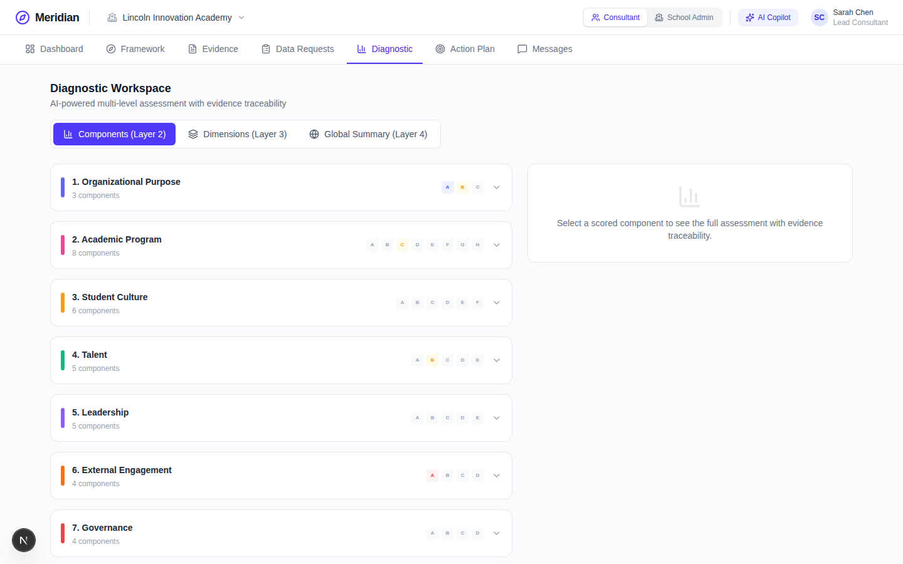

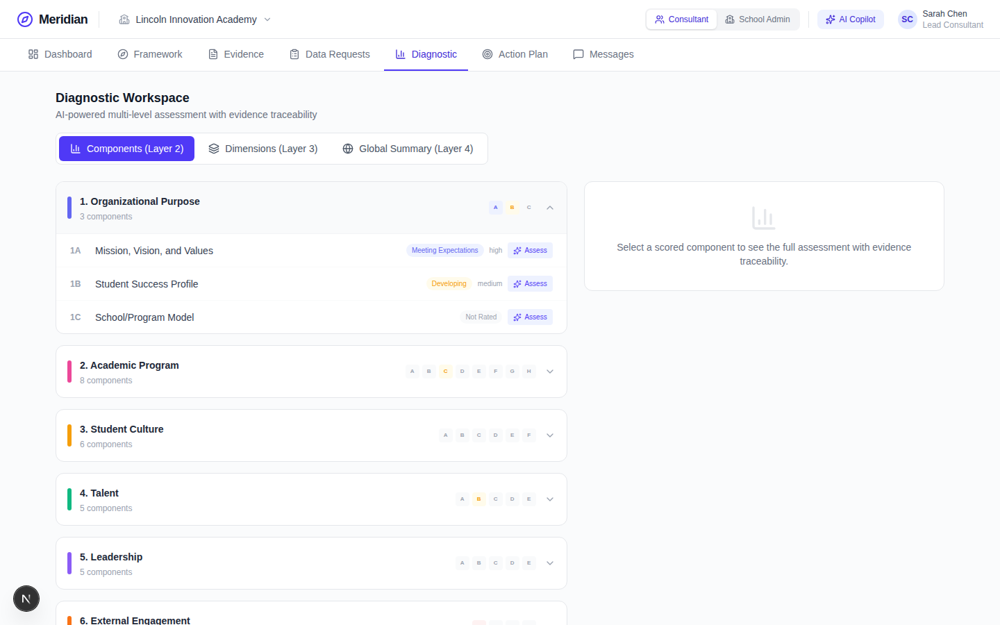

### Action Plan

The Action Plan translates diagnostic findings into prioritized improvement actions. Each item has an owner, target date, description, and — critically — an **evidence-based rationale** that traces the recommendation back to specific findings from the assessment.

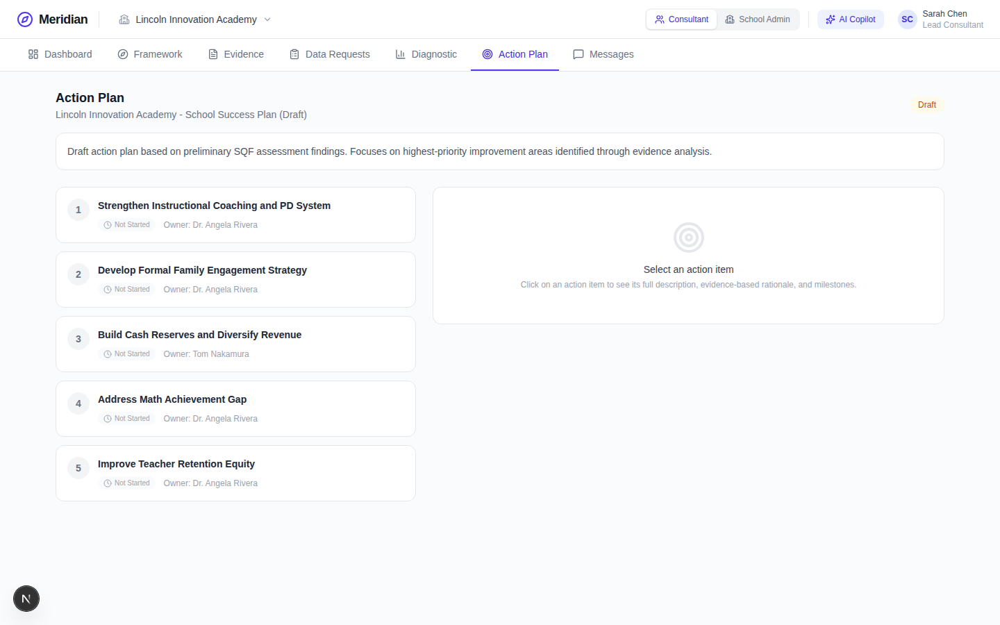

Selecting an action item shows its full detail, including the evidence rationale linking it to specific data points discovered during the assessment.

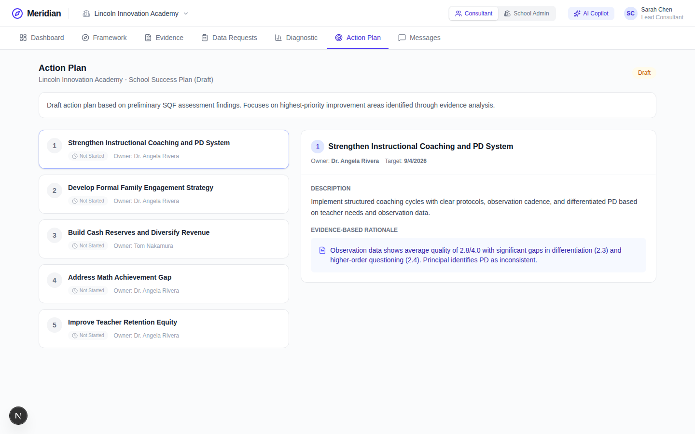

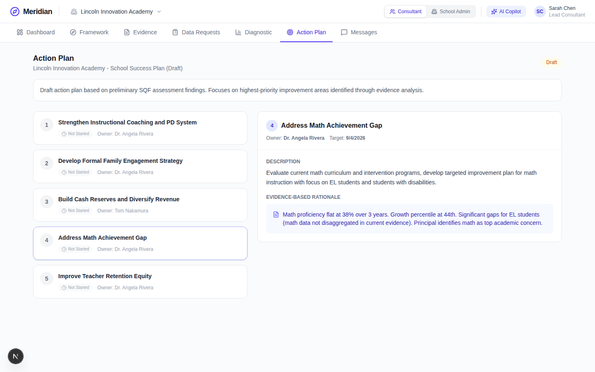

### Messaging

Team messaging keeps all engagement communication in one place. The General Discussion channel shows conversations between the consultant team (Sarah Chen, Marcus Johnson) and school staff (Dr. Angela Rivera, Tom Nakamura) — discussing data gathering, MAP data uploads, and early analysis patterns.

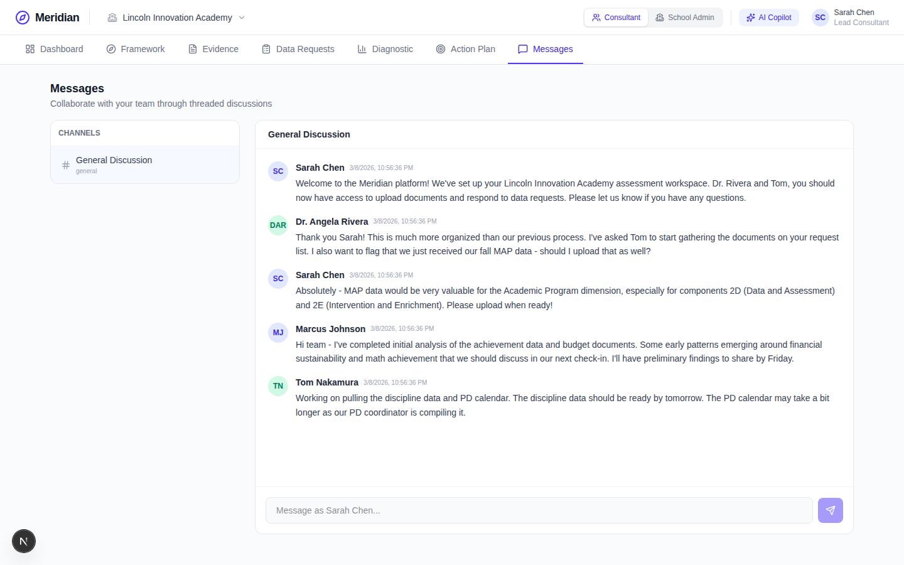

### AI Copilot

The AI Copilot is a contextual assistant available on every screen. It's aware of the current page and engagement context, and offers suggested prompts tailored to where you are in the workflow — from "What evidence do we have about teacher retention?" to "Show me contradictions in the evidence" to "Draft a follow-up request for PD data."

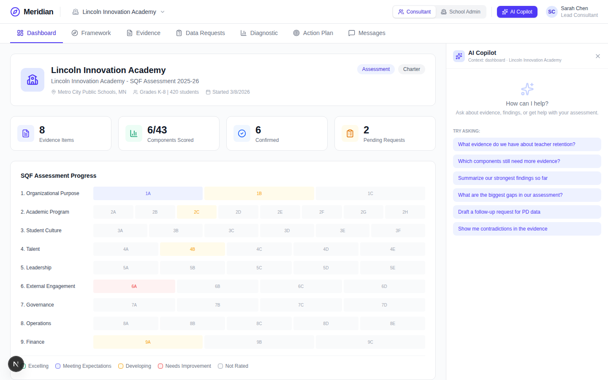

### Role Switching

Meridian is a **two-sided workspace** — consultants and school administrators see the same engagement from different perspectives. The role switcher in the header toggles between Consultant (Sarah Chen) and School Admin (Dr. Angela Rivera) views. The school admin sees the same data but with role-appropriate context (e.g., the message composer says "Message as Dr. Angela Rivera...").

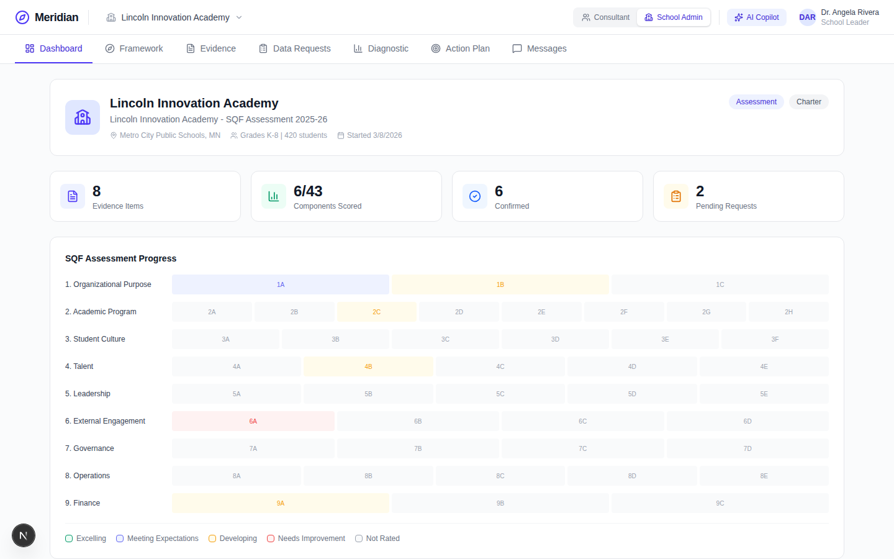

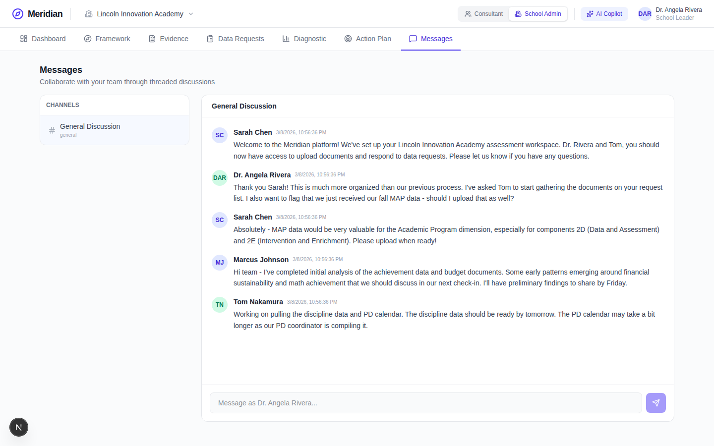

---

## Key Design Principles

- **Evidence traceability** — Every score traces back to source documents through a chain: Evidence → AI Extraction → Evidence Mapping → Component Score. This is non-negotiable.
- **Framework-native** — The SQF ontology is the backbone, not an afterthought. AI reasons within the framework's structure, not outside it.
- **Multi-level AI** — Not one giant LLM pass. Extraction, component, dimension, and global layers each operate within bounded reasoning units.
- **Human-in-the-loop** — AI accelerates expert judgment; consultants review and shape all outputs.
- **Two-sided collaboration** — Consultant-school back-and-forth is central, not a phase-2 add-on.

## Status

This is a working prototype. Key caveats:
- No real authentication yet — the role switcher is UI-only
- No database migrations — schema changes require dropping and recreating the database
- SQF success criteria are hypothesized for prototype purposes (dimension and component names are real)
- Seed data runs on every startup (idempotent)

See [CLAUDE.md](CLAUDE.md) for developer conventions and [handoff.md](handoff.md) for the full product vision and design rationale.
