# Meridian — Feature Tour

A visual walkthrough of Meridian using the seeded demo engagement for **Lincoln Innovation Academy**, a fictional K-8 charter school with 420 students in Metro City Public Schools, MN.

Meridian is a two-sided workspace — consultants and school staff see the same engagement with role-appropriate views. This tour shows both.

---

## Consultant View

### Dashboard

The consultant dashboard provides a real-time view of assessment progress. KPI cards show evidence collected, components scored, confirmations, and pending data requests. The **SQF Assessment Progress** heatmap visualizes all 9 dimensions and 43 components at a glance — color-coded by Bellwether's 4-point rating scale.

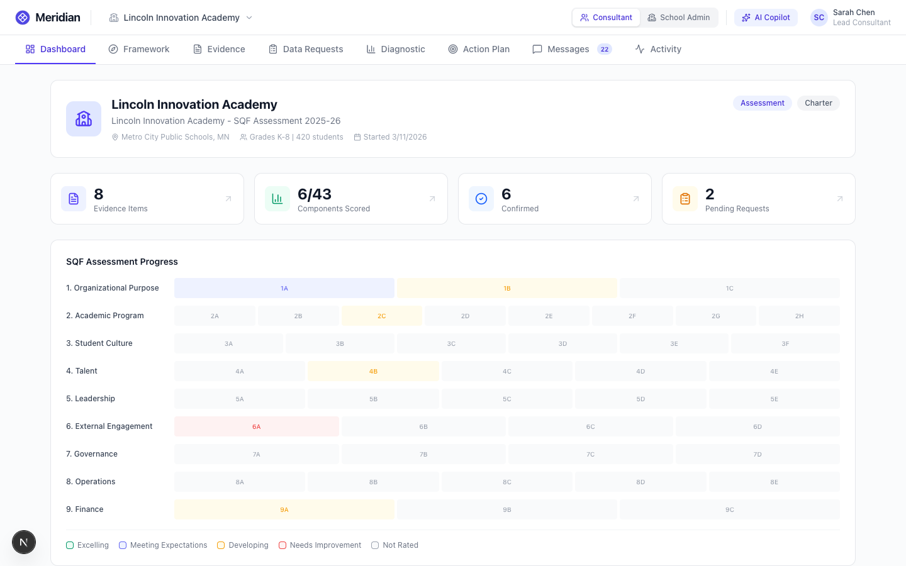

The lower half surfaces **Key Findings** — the most notable preliminary ratings with one-line evidence summaries — and a **Recent Evidence** feed. Every card is clickable: stat cards navigate to their respective tabs, heatmap blocks deep-link to the component in the Diagnostic workspace, and evidence items open in the Evidence tab.

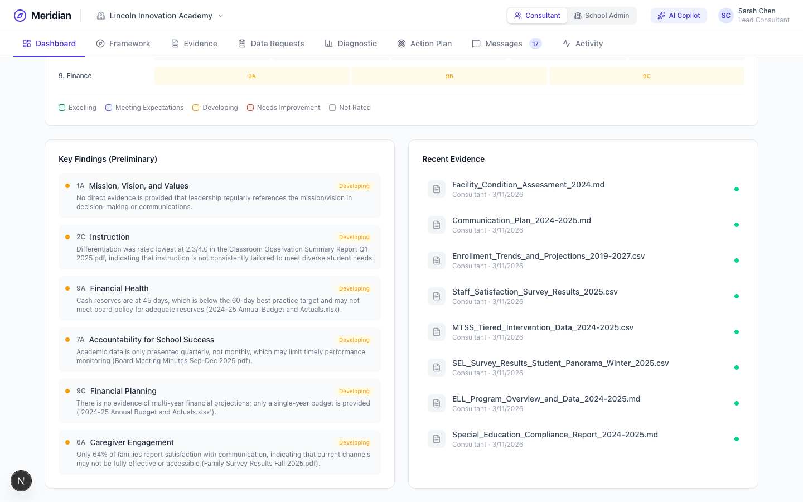

### School Quality Framework Browser

The Framework tab lets users explore Bellwether's SQF structure: 9 dimensions, 43 components, each with Core Actions and Progress Indicators. The three-column layout shows dimensions on the left, components in the center (with ratings, confidence levels, and approval badges), and detailed success criteria on the right.

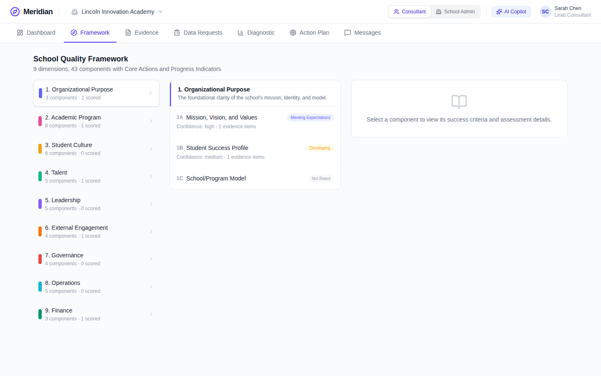

Selecting a component reveals its full success criteria, current score (if assessed), and cross-links to the Diagnostic workspace and Evidence tab. Strengths and gaps are shown inline and are editable in place — click any AI-generated text to refine it.

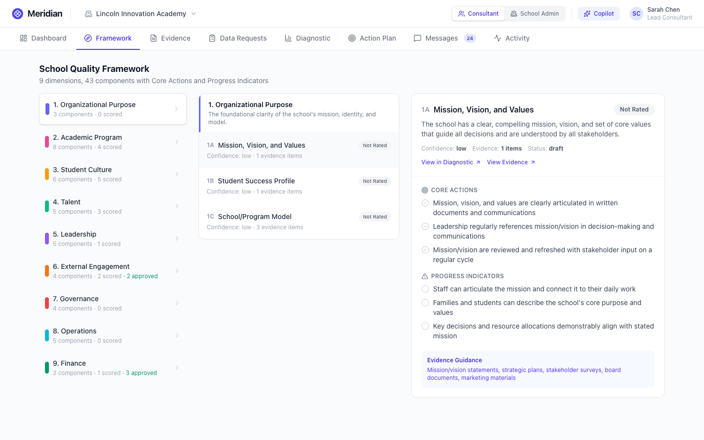

### Evidence Repository

All source documents live here — achievement data, interview transcripts, board minutes, observation reports, budgets, survey results, retention data, and strategic plans. Each document shows processing status and uploader.

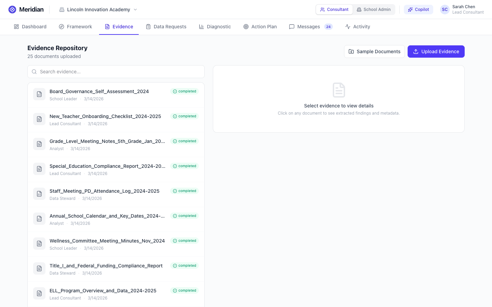

Selecting a document reveals its **AI extraction** — a structured summary and numbered key findings generated automatically on upload. Both the summary and each key finding are editable in place. Preview and download buttons let consultants view the full document or grab the original file. Mapped components are shown as clickable links that navigate to the Framework view.

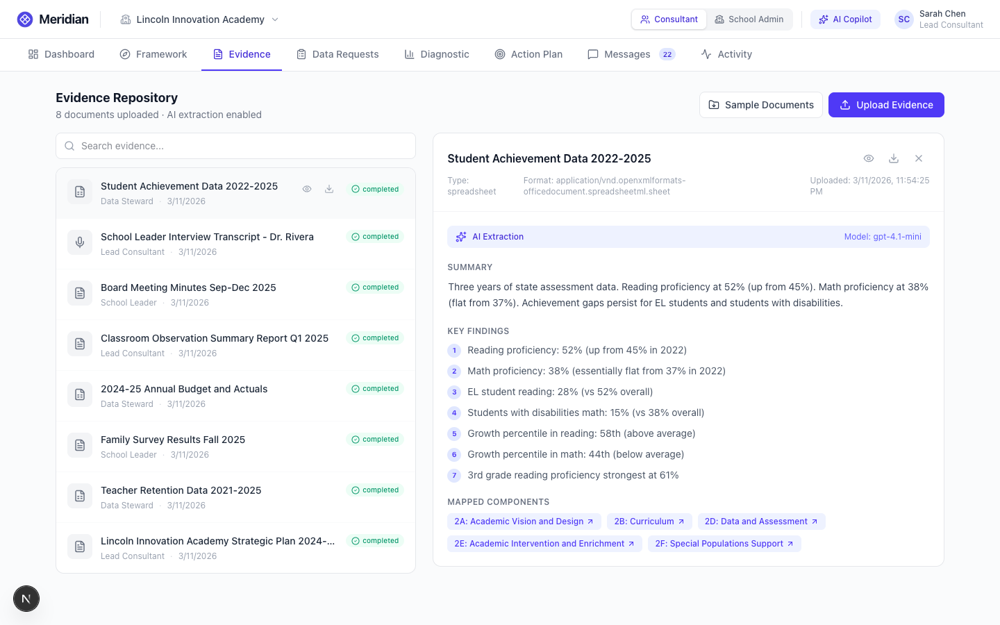

### Data Requests

Consultants send structured data requests tied to specific framework components. Each request has a priority, assignee, status tracking, and a rationale ("Why this is needed"). Inline comment threads let consultants and school staff discuss each request in context. Conversations here are automatically synced to the Messages tab.

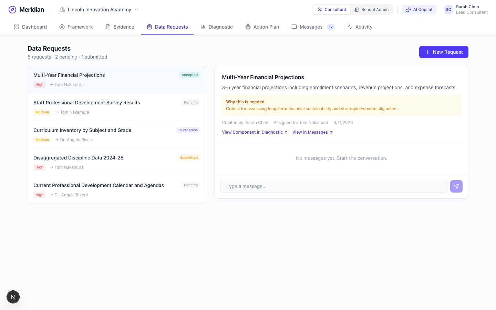

### Diagnostic Workspace

This is Meridian's core analytical tool, implementing the 4-layer AI architecture. Three sub-tabs organize the work:

**Components (Layer 2)** — Each dimension row shows mini heatmap badges for its components. Expanding a dimension reveals individual component assessments with ratings, confidence levels, evidence counts, and "Assess" buttons to trigger AI scoring. The "Generate All Component Assessments" button runs AI assessment across all components at once, skipping those with no evidence and those that have been approved and locked.

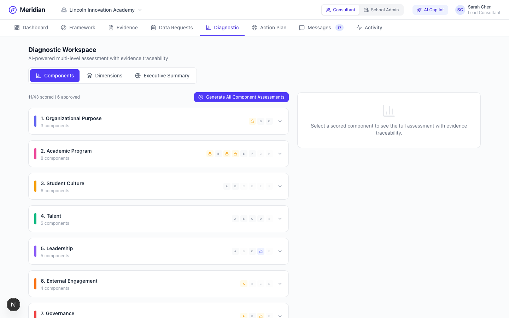

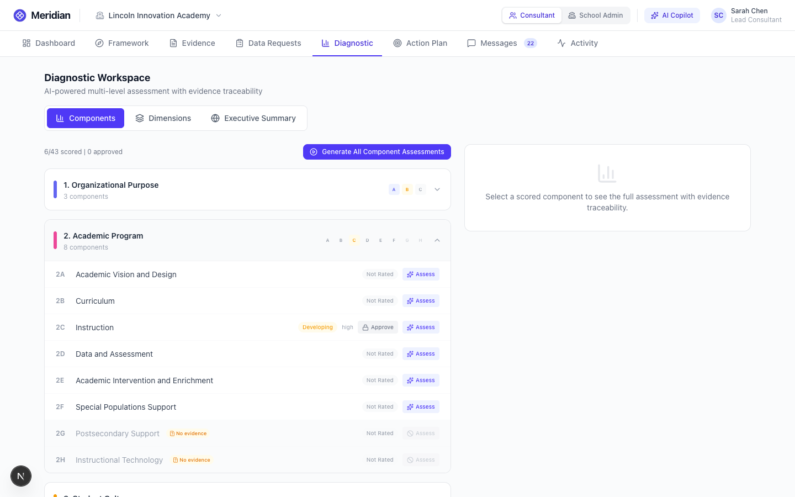

Clicking a component opens its full assessment detail: strengths, gaps, contradictions, AI rationale (now with specific document citations and data points), and suggested actions. Every text field is editable in place. Thumbs up/down feedback lets consultants rate AI quality. The "Approve & Lock" button prevents regeneration until explicitly unlocked.

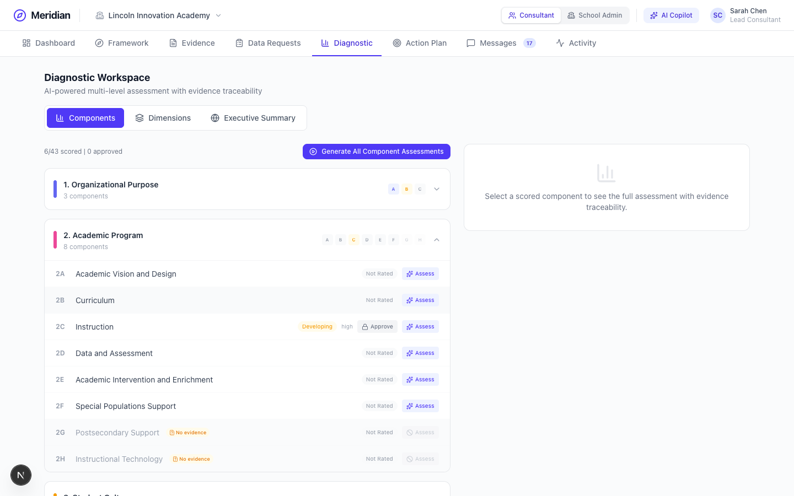

**Dimensions (Layer 3)** — Cross-component synthesis for each of the 9 dimensions. Identifies patterns, compounding risks, top opportunities, and leadership attention items. "Generate All Dimension Summaries" runs synthesis in batch.

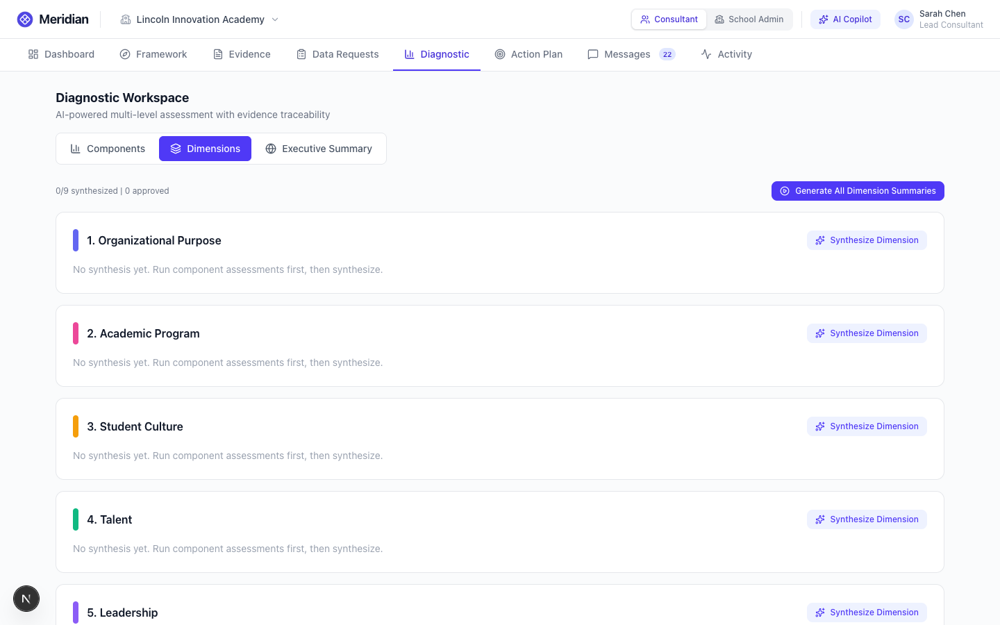

**Executive Summary** — Executive summary across all dimensions. Top strengths, critical gaps, strategic priorities, resource implications, and recommended next steps. Written for a sophisticated education audience.

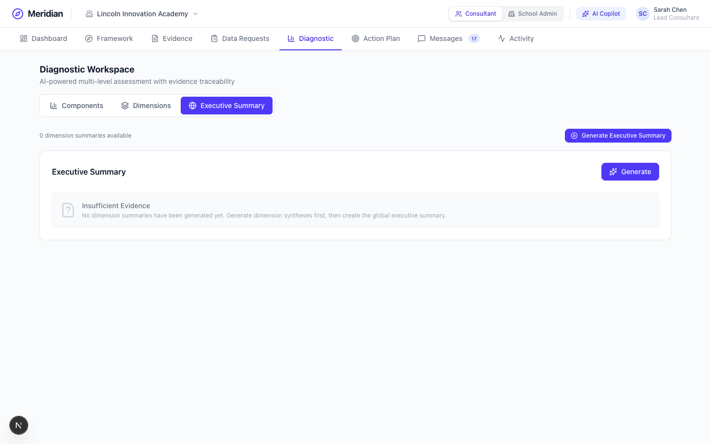

Components with no mapped evidence show a clear "Insufficient Evidence" state instead of fabricated analysis, with guidance to upload or map evidence first.

### Action Plan

Diagnostic findings translate into prioritized improvement actions. Each item has an owner, target date, status, and — critically — an **evidence-based rationale** tracing the recommendation back to specific assessment findings. Descriptions and rationale are editable in place. Cross-links navigate to the related component in the Framework or Diagnostic views.

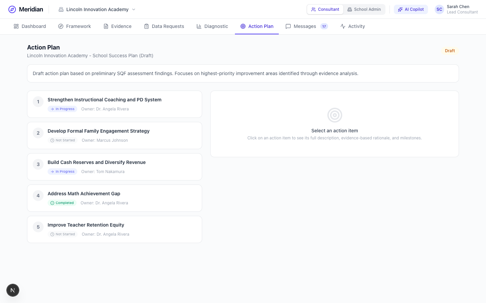

Selecting an action item opens a detail panel with the full description, evidence-based rationale, owner, target date, and cross-navigation links to the related component in the Framework or Diagnostic views.

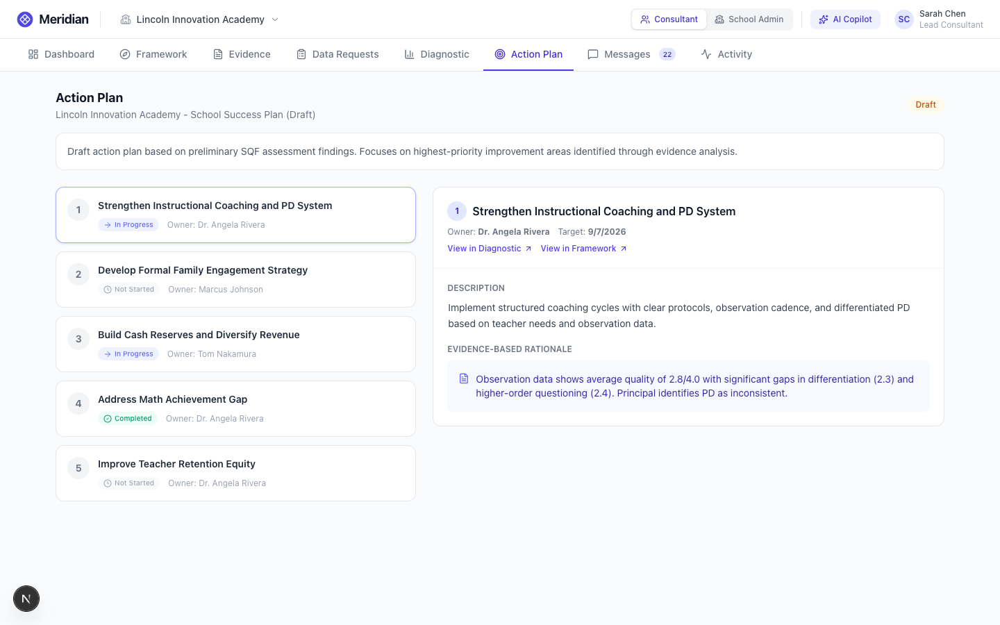

### Messaging

A Slack-style messaging experience for engagement communication. The sidebar is split into **Channels** (general discussion, document review, leadership prep) and **Data Requests** (conversations from data request threads, automatically synced).

Features include channel creation, @mentions with a member dropdown (type `@` to trigger), message grouping for consecutive messages from the same author, day separators, and relative timestamps. Data request threads show a banner linking back to the request in the Data Requests tab.

Users can also type `@Meridian AI` in any chat to invoke the AI copilot inline. The AI responds with formatted markdown, can create data requests, and its responses appear with a distinctive sparkle avatar and AI badge.

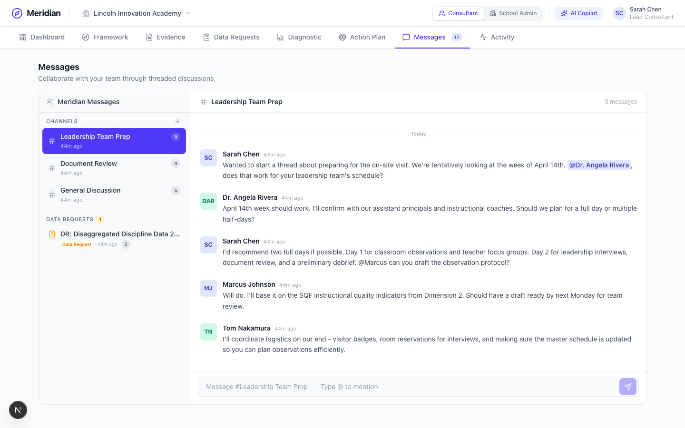

### Activity Log

Tracks all engagement actions — uploads, AI assessments, approvals, edits, data requests, messages — with varied actors, action types, and timestamps grouped by day. This provides a complete audit trail of who did what and when across the engagement.

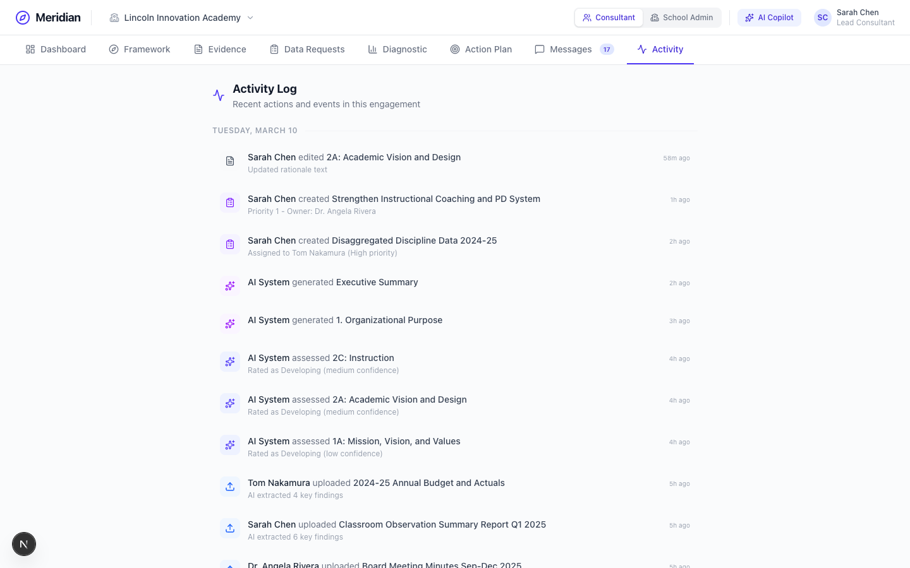

### AI Copilot

A contextual assistant available on every screen via the "AI Copilot" toggle. It knows the current page context and engagement data, and can answer questions, find evidence, explain ratings, and draft content. Suggested prompts are context-aware — they change based on which tab is active (Dashboard shows progress questions, Evidence shows document questions, etc.).

The copilot can also **create data requests** directly from chat using tool calling — say "Create a data request for the school's PD logs and assign it to Tom" and it will extract the details, create the request in the database, and show a confirmation card with a link to view it.

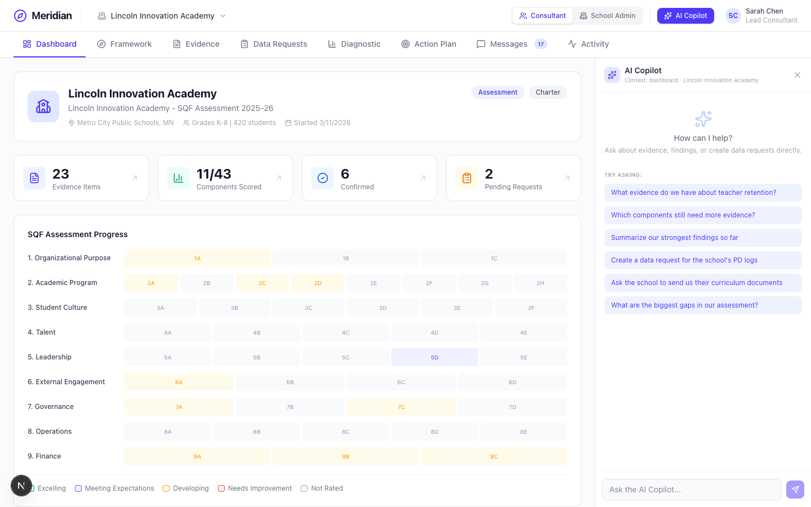

---

## School Admin View

Switching to the School Admin role (Dr. Angela Rivera, School Leader) transforms the experience. The same data is presented through a progress-and-action lens, with no AI terminology, no generation controls, and no indication that content is AI-generated or editable.

### School Admin Dashboard

The dashboard centers on **what the school needs to do** and **how the assessment is progressing**. A circular progress ring shows overall completion. The "Your Action Items" section surfaces pending data requests (needs your response), in-progress items (finish and submit), and submissions under review — or "You're all caught up" when nothing's needed.

The heatmap and findings are still visible, giving the school leader transparency into where things stand. "Not Rated" components show as "Pending" instead.

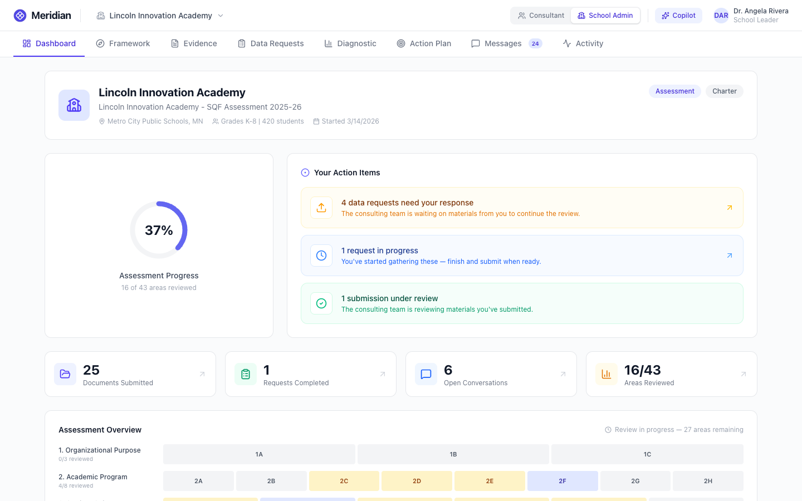

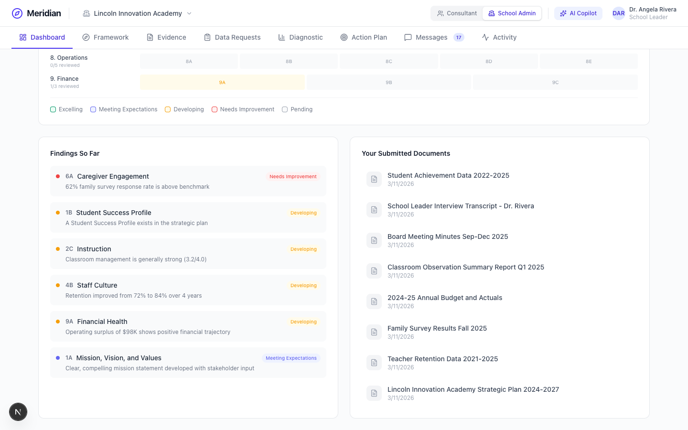

### School Admin Assessment View

The same assessment data, presented as clean read-only results. No "Assess" buttons, no "Generate All", no approval toggles. "Gaps" are relabeled as "Areas for Growth." AI rationale and contradictions sections are hidden entirely. If the assessment isn't far enough along, a professional "Assessment in progress" state replaces the content.

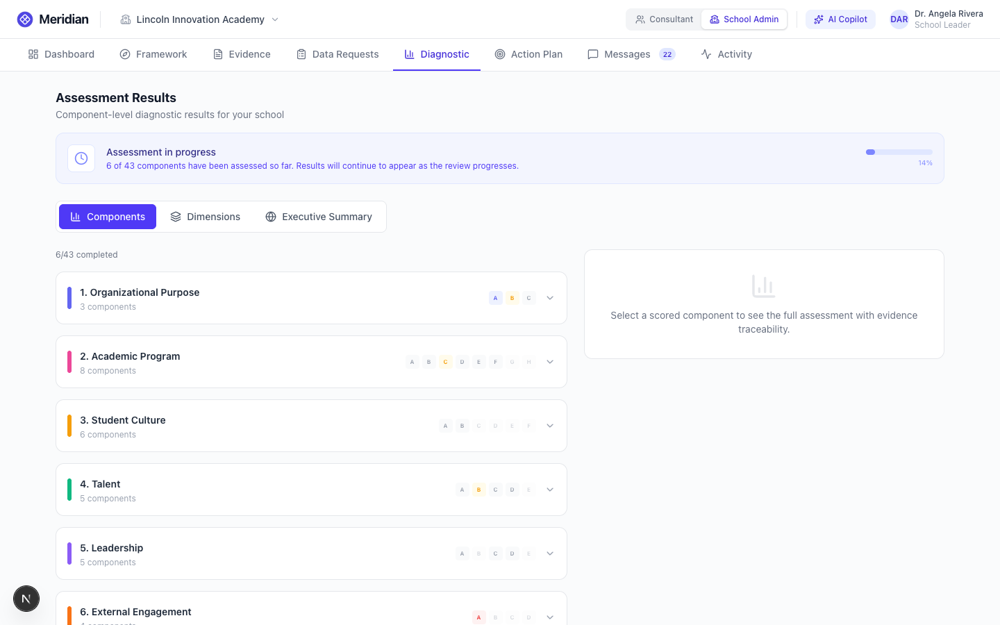

### School Admin Data Requests & Messages

Data requests show the same request details and comment threads, with role-appropriate author attribution. The messaging view is identical in functionality — both roles participate in the same conversations.

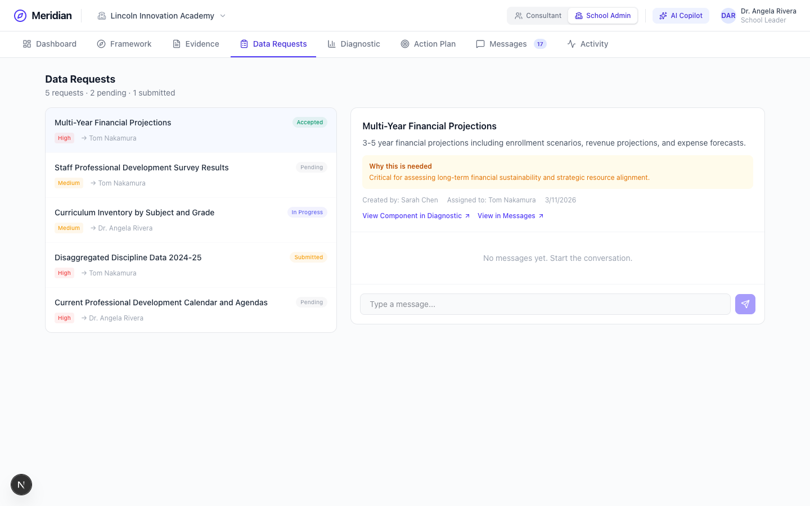

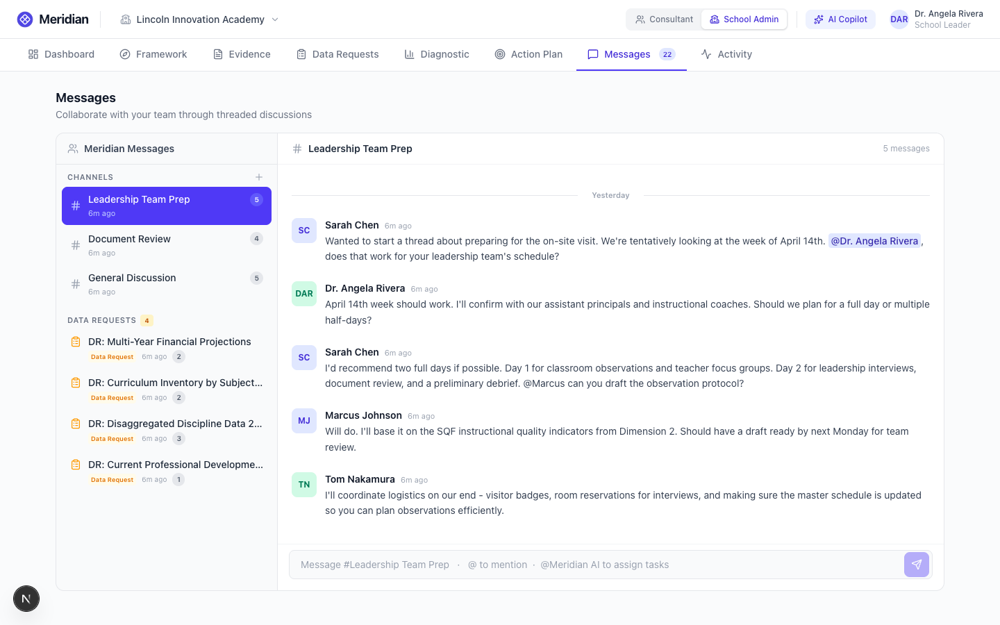

---

## Cross-Navigation

Every reference to an object in the app is a working link. Component codes in the Evidence tab navigate to the Framework view. Evidence counts in the Diagnostic workspace link to the Evidence tab. Data request thread banners in Messages navigate to the Data Requests tab. Dashboard cards and heatmap blocks deep-link to their respective targets. The copilot's data request confirmation cards link to the newly created request.

Navigating from the Diagnostic or Framework views to Evidence automatically filters the evidence list to show only items mapped to that component, with a dismissible banner indicating the active filter.

This cross-linking means you can follow any thread of reasoning — from a score to its evidence, from a data request to its conversation, from a finding to its action plan item — without losing context.

---

## Demo Documents

The `demo_uploads/` folder contains 29 realistic school documents (CSVs, markdown reports, and text files) covering all 9 SQF dimensions. These are not seeded in the platform — they're meant to be uploaded during a demo to show the full evidence processing pipeline in action.
