# Meridian — Feature Tour

A visual walkthrough of Meridian using the seeded demo engagement for **Lincoln Innovation Academy**, a fictional K-8 charter school with 420 students in Metro City Public Schools, MN.

Meridian operationalizes Bellwether's School Quality Framework — a diagnostic tool built around 9 dimensions and 43 components that define what it looks like for a school to deliver strong academic, social-emotional, and life outcomes for every student, with intentional focus on those furthest from opportunity.

Meridian is a two-sided workspace — consultants and school staff see the same engagement with role-appropriate views. This tour shows both.

---

## Consultant View

### Dashboard

The consultant dashboard provides a real-time view of assessment progress. KPI cards show evidence collected, components scored, confirmations, and pending data requests. The **SQF Assessment Progress** heatmap visualizes all 9 dimensions and 43 components at a glance — color-coded by Bellwether's 4-point rating scale. Every element is clickable: stat cards navigate to their respective tabs, heatmap blocks deep-link to the Diagnostic workspace, and evidence items open in the Evidence tab.

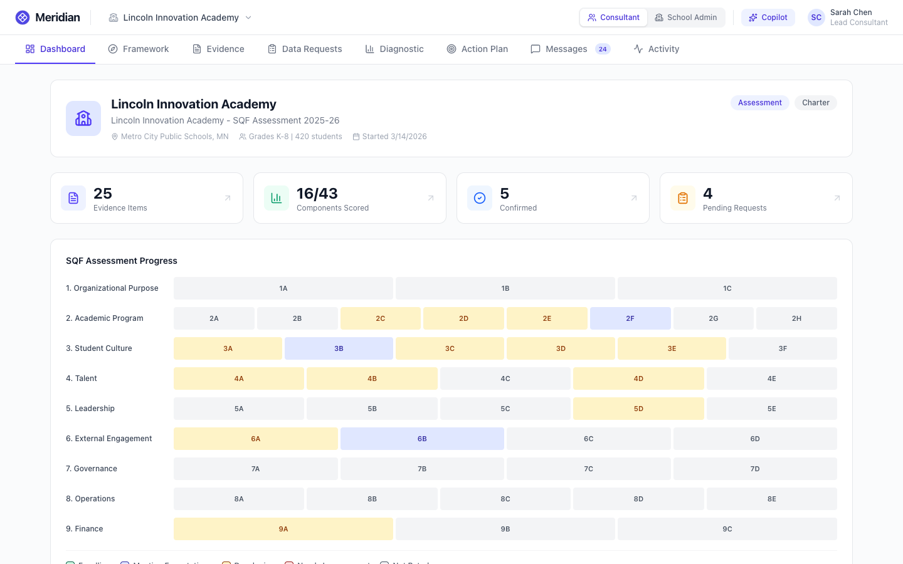

Below the fold, **Key Findings** surface the most notable preliminary ratings with one-line evidence summaries, and a **Recent Evidence** feed shows the latest uploads.

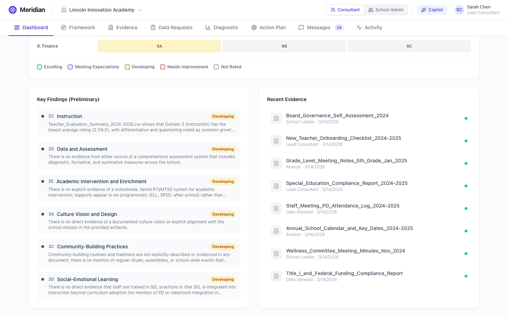

### School Quality Framework Browser

The Framework tab lets users explore Bellwether's SQF structure: 9 dimensions, 43 components, each with Core Actions and Progress Indicators. Selecting a component reveals its full success criteria, current score, and cross-links to the Diagnostic workspace and Evidence tab. Strengths and gaps are editable in place.

### Evidence Repository

All source documents live here. Each document shows processing status and uploader. Hover actions reveal preview, download, and delete. Selecting a document shows its **AI extraction** — a structured summary and numbered key findings generated automatically on upload. The title, summary, and each key finding are editable in place. Mapped components are clickable links to the Framework view. Deleting evidence automatically marks any component scores that relied on it as stale. Navigating here from the Diagnostic or Framework views automatically filters the list to the relevant component, with a dismissible banner showing the active filter.

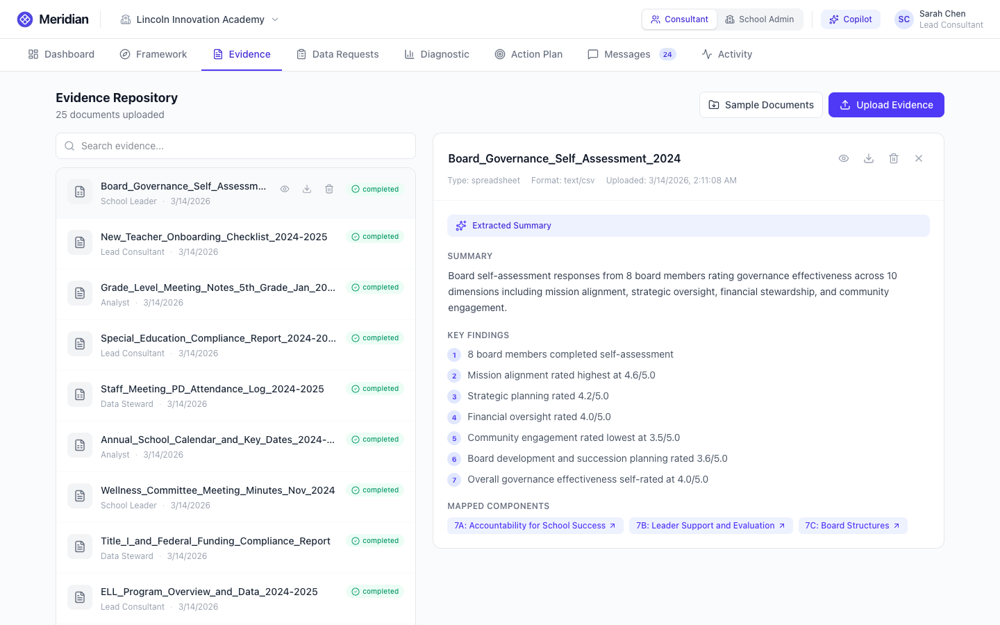

### Data Requests

Consultants send structured data requests tied to specific framework components. Each request has a priority, assignee, status tracking, and a rationale. All fields are editable inline — click priority or status badges to cycle values. Inline comment threads let both sides discuss each request in context, synced automatically to the Messages tab.

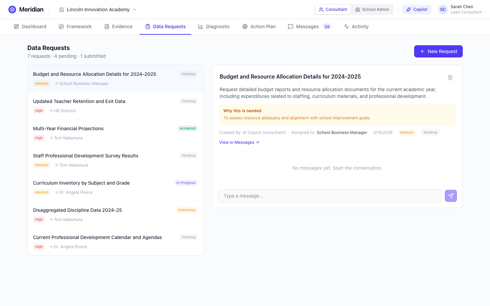

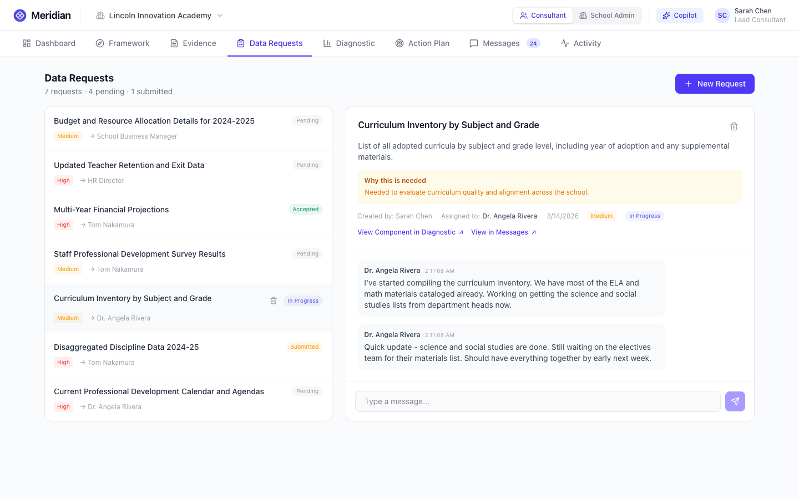

### Diagnostic Workspace

This is Meridian's core analytical tool, implementing the 4-layer AI architecture. Three sub-tabs organize the work:

**Components** — Each dimension row shows mini heatmap badges. Expanding a dimension reveals individual assessments with ratings, confidence, evidence counts, and "Assess" buttons. Components with new evidence since their last assessment show a blue **"+N new"** badge, making it easy to spot where re-assessment might be valuable. Components whose evidence was deleted show an amber **"Evidence removed"** indicator.

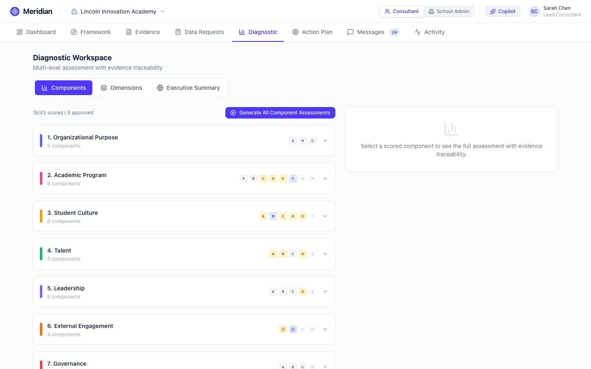

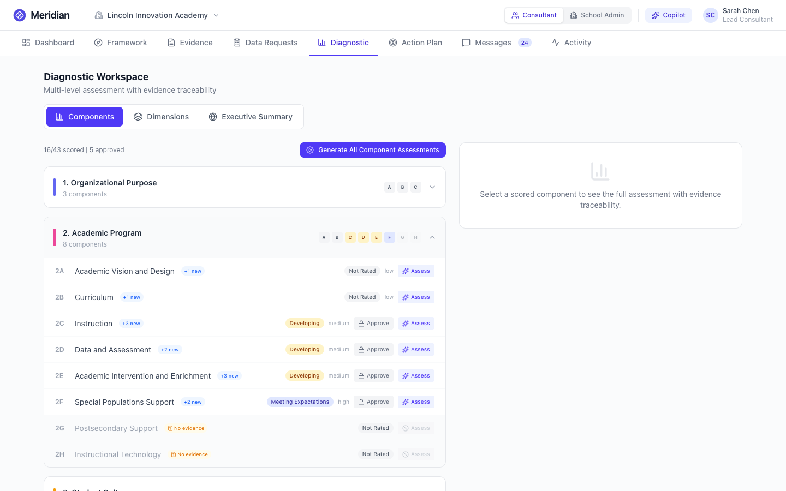

Clicking a component opens its full assessment detail: strengths, gaps, contradictions, AI rationale with document citations, and suggested actions. Every field is editable. When new evidence is available, a collapsible section at the top shows each item with its title, upload date, and relevance score — clickable to navigate to the Evidence tab.

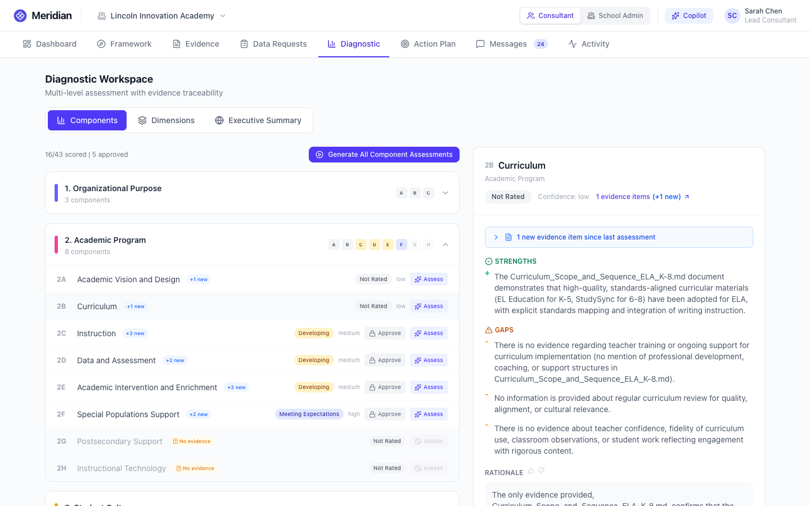

**Dimensions** — Cross-component synthesis identifying patterns, compounding risks, top opportunities, and leadership attention items.

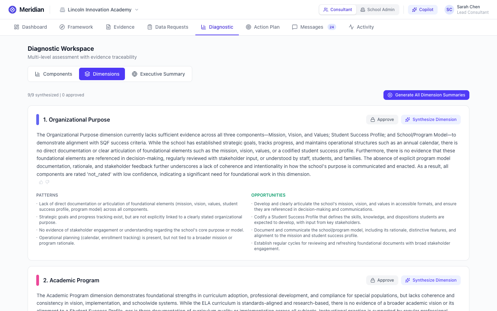

**Executive Summary** — Strategic overview across all dimensions: top strengths, critical gaps, priorities, resource implications, and next steps.

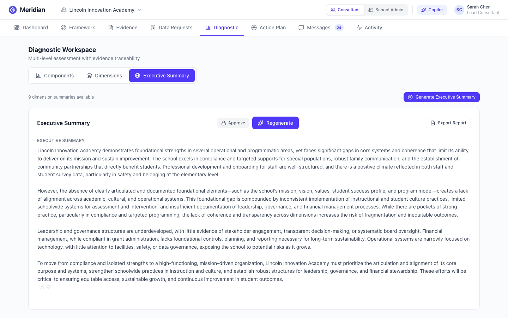

Components with no mapped evidence show a clear "Insufficient Evidence" state instead of fabricated analysis.

### Action Plan

Diagnostic findings translate into prioritized improvement actions. Each item has an owner, target date, status, and an **evidence-based rationale** tracing the recommendation back to assessment findings. Descriptions and rationale are editable in place. Cross-links navigate to the related component in the Framework or Diagnostic views.

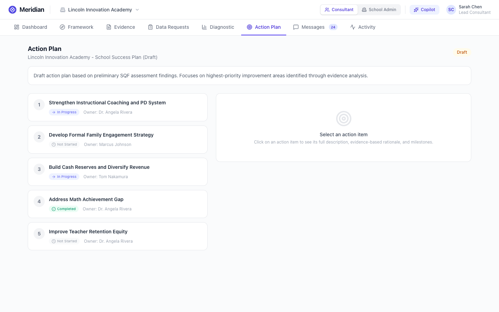

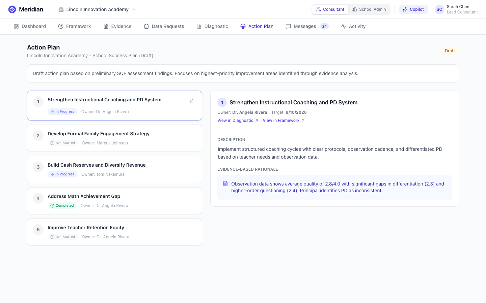

### Messaging

A Slack-style messaging experience. The sidebar splits into **Channels** and **Data Requests** (synced from data request comment threads). Features include channel creation, @mentions with a member dropdown, message grouping, day separators, and relative timestamps. Data request threads show a banner linking back to the Data Requests tab.

Type `@Meridian AI` in any chat to invoke the AI copilot inline — it can answer questions, create data requests via tool calling, and responds with formatted markdown.

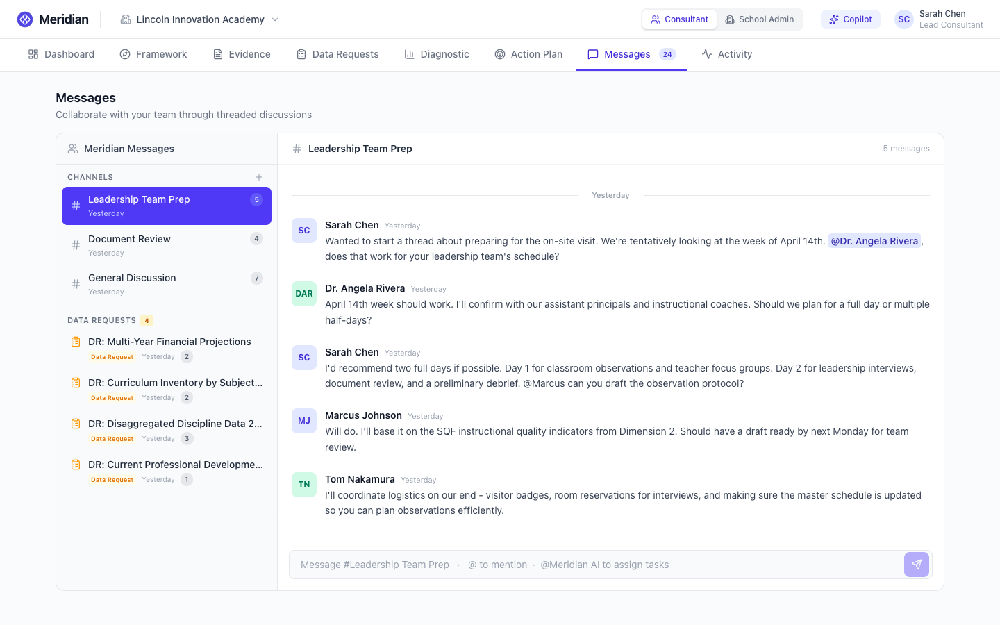

### AI Copilot

A contextual assistant available on every screen. It knows the current page context and engagement data, and can answer questions, find evidence, explain ratings, and draft content. Suggested prompts change based on which tab is active. The copilot can **create data requests** directly from chat — say "Create a data request for the school's PD logs and assign it to Tom" and it will create the request and show a confirmation card.

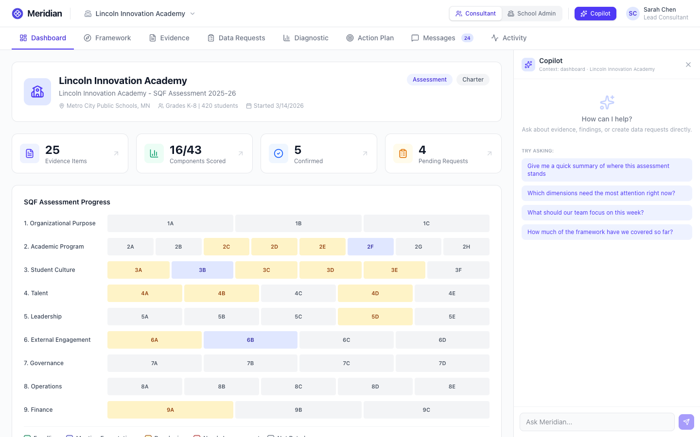

### Activity Log

A complete audit trail of every engagement action — uploads, assessments, approvals, edits, messages — grouped by day. Useful for tracking who did what and when across the full assessment lifecycle.

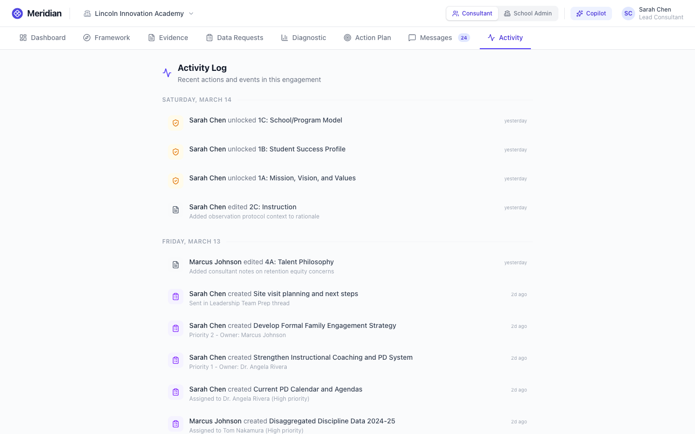

---

## School Admin View

### The School Experience

Switching to the School Admin role (Dr. Angela Rivera, School Leader) transforms the interface. The same engagement data is presented through a progress-and-action lens — the school sees the current state of the assessment with clear next steps.

The dashboard centers on **what the school needs to do**: a progress ring shows overall completion, and "Your Action Items" surfaces pending requests, in-progress work, and submissions under review.

Assessment results are presented as clean, read-only findings. "Gaps" are relabeled as "Areas for Growth." If the assessment isn't complete, a professional "Assessment in progress" banner replaces the content. Data requests and messaging work identically for both roles.

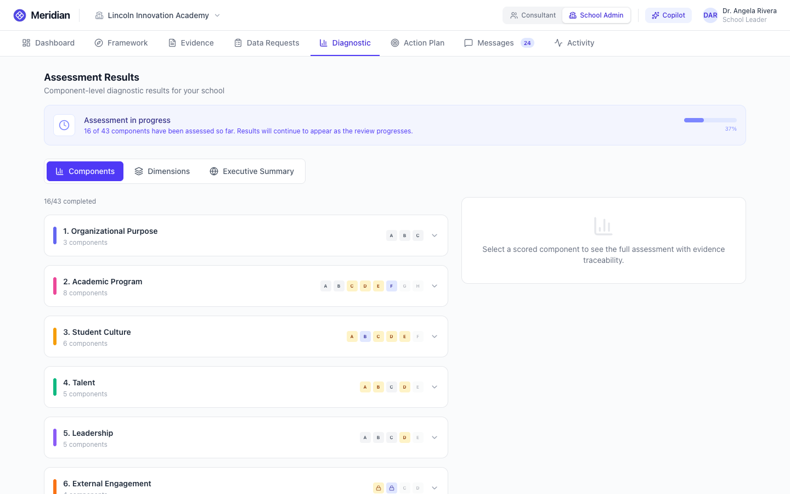

---

## Demo

The demo engagement for **Lincoln Innovation Academy** is designed to be mid-flight — not a blank slate and not fully complete. Some components are already scored with AI-generated assessments, while others are still pending. Data requests are in various states, messaging channels have realistic conversation history, and the action plan has draft improvement items. This gives you something to explore in every tab.

To try the evidence pipeline, upload files from `demo_uploads/` in the backend directory. It contains 29 realistic school documents (CSVs, markdown reports, and text files) covering all 9 SQF dimensions. Uploading triggers automatic extraction, component mapping, and evidence summarization — the same workflow a real engagement would follow.
